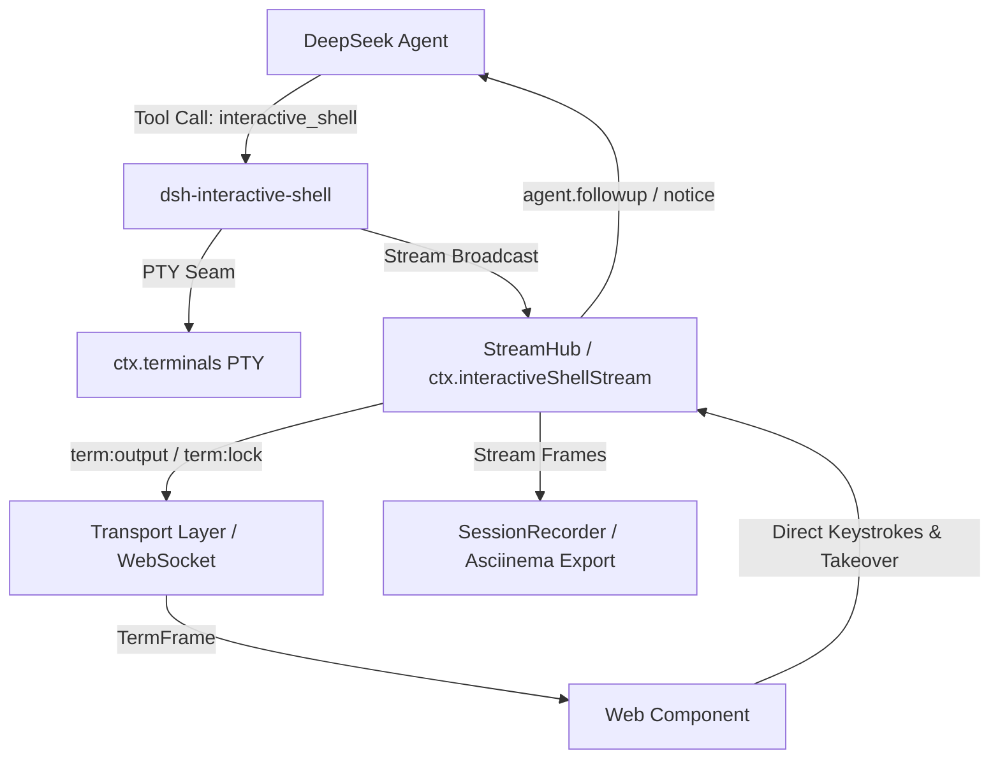

# dsh-interactive-shell

让 Agent 亲手驱动真实交互式 CLI（vim / psql / ssh / `npm run dev` / `docker logs -f`），用户在 Web 端实时观看输出并可随时按键接管。移植自 [pi-interactive-shell](https://github.com/nicobailon/pi-interactive-shell)，深度融合 DeepSeek Harness 的 `ctx.terminals` PTY 缝隙与 Cordis 服务总线。

**状态：已对齐 dsh 0.1.7-rc.2（101/101 测试全绿，行覆盖率 96.57%）。最低宿主版本 dsh ≥ 0.1.7-rc.2。**

---

## 核心特性

- **四种驱动模式**：
  - `interactive`：持久 `sessionId`，Agent 按需发送输入、轮询状态，支持人机双向接管；
  - `hands-free`：静默窗自动判定，Agent 无需高频探询；
  - `dispatch`：一次性子任务派发（如构建/测试），完成或超时后单次唤醒 Agent 并携带尾部日志；
  - `monitor`：基于正则触发器或文件系统变更（`watch`）监听，命中时主动注入 Notice 唤醒 Agent，全周期 0 模型轮询开销。
- **M5: 生产安全沙箱与敏感数据脱敏 (P0)**：
  - **安全策略分级**：`permissive` / `balanced` / `strict`，内置高危破坏性指令拦截（`rm -rf /`、`mkfs`、`dd`、`chmod 777 /`、fork bomb、`del /s /q`、`format c:`、`curl | sh`）；
  - **凭据脱敏引擎**：自动抹除 OpenAI/DeepSeek API Key、GitHub Token、AWS Key、Slack Token、JWT 及各类密码与私钥；
  - **流量熔断保护**：`StreamCircuitBreaker` 动态速率限流，抵御海量输出打爆客户端。
- **M4 & M6: Web UI 实时流、人机接管与 Web Component SDK (P1)**：
  - **流式分发中枢（`StreamHub`）**：支持环形缓冲区历史回放、帧广播（`init` / `output` / `event` / `lock` / `exit`）；
  - **双向人机接管（Takeover & Handback）**：用户在 Web 端一键接管控制权，按键直通 PTY，拦截 Agent 冲突写；交还控制权时自动携带用户备注唤醒 Agent；
  - **原生 Web Component（`<dsh-shell-dock>`）**：Shadow DOM 样式隔离，支持浅色/深色双主题切换与自定义事件；
  - **远程网关传输层（`transport`）**：支持 WebSocket/SSE 与内存直连适配器。
- **M7: 会话时光机与 Asciinema 导出 (P2)**：
  - **Asciinema v2 导出**：导出标准 `.cast` 格式录像文件；
  - **人机归因分析**：`getTimelineAttribution` 划分人类与 Agent 操作时间轴；
  - **时光机屏幕重构**：`getTimeTravelSnapshot` 按任意历史时间戳重构虚拟屏幕缓冲区。
- **M8: 智能 CLI 交互提示词与菜单解析 (P3)**：
  - **交互式提示识别**：自动识别 `(y/N)` 确认、密码输入、单选光标菜单与多选复选框；
  - **自动按键生成**：`generatePromptAnswer` 自动计算上下光标方向键与回车，避免模型猜键开销。

---

## 架构概览



---

## 与 dsh 0.1.7 的集成前提（必读）

dsh **0.1.7-rc.2** 起，PTY 家族（`@deepseek-ai/dsh-terminal` +
`@deepseek-ai/dsh-terminal-bash`）改由 **agent preset** 挂载在 `isolate`
隔离域内；`dsh-base` / `dsh-web-app` 不再提供 host 级 `ctx.terminals`，
且默认的 `standard` preset 本身**不含** PTY。因此：

- 本插件按调用方 agent 逐次解析注册表：
  `ctx.agentPresets.serviceFor(agent, 'terminals')`，若本行与 PTY provider
  同域（把桥接行放进同一 isolate realm）则回退 `ctx.get('terminals')`；
- **所选 preset 必须挂载 PTY 家族**，例如 dsh 自带的 `minimal` preset
  （其 `persistent-shell` 组同时挂 `pty` + `terminal-bash` + persistent 工具）；
- 该 agent 的 preset 没有 PTY 时，`interactive_shell` 调用会抛出带安装
  指引的错误（**不再静默不注册**），组合里完全没有 PTY 缝隙时启动即告警；
- 会话的输出增量按 `totalLines` 差分交付（`read()` 的 `offset` 是回退偏移，
  不是前进游标），`attach-monitor` 的零等待探针读当前页后重同步游标。

---

## 配置项

全部配置项与 `cordis.patch.yml` 中的行一一对应（schema 里都有同值默认值）：

| 配置 | 默认 | 作用 |
|---|---|---|
| `defaultMode` | `monitor` | `spawn` 未指定 `mode` 时的默认驱动模式 |
| `maxSessions` | `4` | 本插件**自己**持有的存活会话上限（其他工具的 PTY 不计入） |
| `backendType` | `shell` | 新会话使用的 PTY 后端类型（对应 `terminal-bash.backendType`） |
| `outputTailBytes` | `4096` | 每次事件/唤醒交给模型的尾部字节预算 |
| `dispatchQuietMs` | `5000` | dispatch 模式：输出静默多久判定为完成 |
| `dispatchTimeoutMs` | `600000` | dispatch 模式：默认绝对 deadline（`spawn` 可用 `timeoutMs` 覆盖） |
| `monitorCooldownMs` | `2000` | monitor 模式：两次触发唤醒的最小间隔 |
| `monitorMaxEvents` | `100` | monitor 模式：单个 monitor 的事件预算，用尽后自动脱离 |
| `maxOutputBytesPerSec` | `524288` | 镜像到 Web 端的输出速率上限，超限广播 `output-throttled` |
| `tracePath` | `''` | JSONL 台账路径；空 = `$DSH_HOME`（未设置为 `~/.dsh`）下的 `interactive-shell/traces.jsonl` |
| `securityPolicy` | `balanced` | 自研命令策略级别（`permissive` / `balanced` / `strict`） |
| `blockedCommands` / `allowedCommandsOnly` | `[]` | 显式的命令黑名单 / 白名单前缀 |
| `redactSensitiveData` | `true` | 对模型可见输出与台账做凭据脱敏 |

---

## 模式与时序

| 模式 | Agent 行为 | 输出如何反馈给 Agent | 适用场景 |
|---|---|---|---|
| `interactive` | 异步驱动，按需交互 | 随时调用 `read` 或 `status` 检查输出 Tail | vim / psql / SSH 交互式会话 |
| `hands-free` | 异步观察 | 静默窗触发后主动反馈 | 短时构建、脚本执行 |
| `dispatch` | 派发后继续执行其他任务 | 进程退出/静默/超时后，通过 `agent.followup` 单次主动唤醒 | 长耗时测试或编译任务 |
| `monitor` | 休眠等待 | 匹配到正则 `trigger` 或文件变更时，通过 `agent.followup` 唤醒 | 日志监控、Dev Server 启动探针 |

---

## 快速使用指南

### 1. 使用原生 Web Component `<dsh-shell-dock>`

```html
<script type="module">
  import { defineDshShellComponent } from 'dsh-interactive-shell'
  defineDshShellComponent()
</script>

<dsh-shell-dock theme="dark"></dsh-shell-dock>
```

### 2. 导出 Asciinema 录像与时光机快照

```typescript
import { SessionRecorder } from 'dsh-interactive-shell'

const recorder = new SessionRecorder()
// 记录流式帧
streamHub.subscribeAll(frame => recorder.record(frame))

// 导出 Asciinema v2 .cast 字符串
const castJsonl = recorder.exportAsciinema('session_123', { title: 'Dev Build' })

// 获取任意历史时刻（如 10 秒前）的虚拟屏幕内容
const snapshotLines = recorder.getTimeTravelSnapshot('session_123', Date.now() - 10000)
```

### 3. 智能解析 CLI 交互式提示词

```typescript
import { parseInteractivePrompt, generatePromptAnswer } from 'dsh-interactive-shell'

const prompt = parseInteractivePrompt(terminalTail)
if (prompt?.kind === 'select_menu') {
  const answerKeys = generatePromptAnswer(prompt, { preferredChoice: 'TypeScript' })
  // 自动生成 '\x1B[B\n'（方向下键+回车）
  await tool.execute({ action: 'send', sessionId, input: answerKeys })
}
```

---

## 🚀 运行示例（Runnable Examples）

仓库内置了开箱即用的演示示例，可直接运行体验：

```bash
# 1. 智能 CLI 交互提示词自动应答（确认框、多级单选、数字菜单、多选复选框按键生成）
node examples/demo-auto-responder.mjs

# 2. 会话录制、人机协作归属占比与时光机快照回放导出 Asciinema .cast
node examples/demo-recorder.mjs

# 3. 浏览器查看 <dsh-shell-dock> Web Component 主题切换与接管联动演示
# 在浏览器中直接打开 examples/demo-web-client.html
```

---

## 质量与验收指标

- **自动化测试**：101/101 项测试全部通过（包含单元测试、时序回归测试、P0~P3 全里程碑特性验证、M4 E2E 完整生命周期场景、Web Component 深度单测、自适应极速探针、提示词按键序列生成器、WsClientTransport / LocalStreamTransport 深度测试，以及 dsh 0.1.7 对齐的 **`test/p0-regression.test.mjs`**（seam 按 agent 解析、增量不重不漏、同行原地改写、scrollback 裁剪重对齐、消息源 kind）与**工具契约回归**（schema 校验、backendType、预算归属、per-call `timeoutMs`、镜像限流））。
- **代码覆盖率**：全工程综合行覆盖率 **96.57%**，分支 **86.18%**，函数 **94.74%**（v8，`node --experimental-test-coverage`，对 dsh 0.1.7-rc.2 依赖复测；0.3.4 基线为 96.05% / 85.60% / 93.96%）。
- **代码规范**：`tsc --strict` 与 `oxlint` 0 警告、0 错误；依赖对 **dsh 0.1.7-rc.2** 的真实发布包完成 typecheck。
