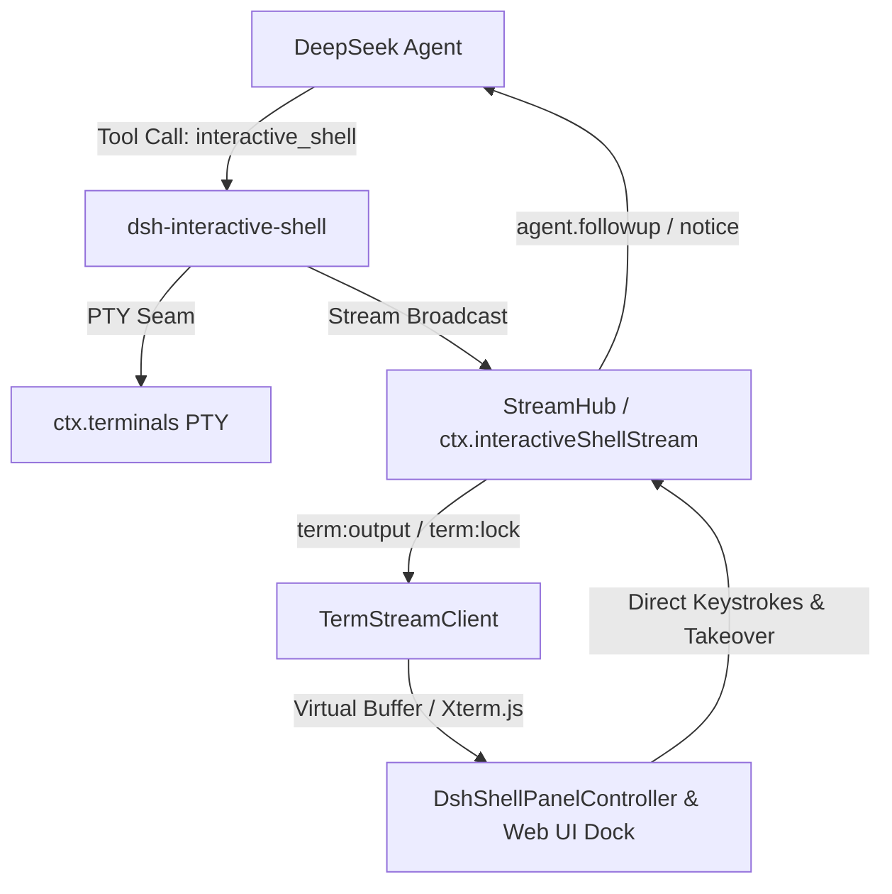

# dsh-interactive-shell

让 Agent 亲手驱动真实交互式 CLI（vim / psql / ssh / `npm run dev` / `docker logs -f`），用户在 Web 端实时观看输出并可随时按键接管。移植自 [pi-interactive-shell](https://github.com/nicobailon/pi-interactive-shell)，深度融合 DeepSeek Harness 的 `ctx.terminals` PTY 缝隙与 Cordis 服务总线。

**状态：生产就绪（M1 ~ M4 全量实现，单元/集成/E2E 51/51 测试全绿，覆盖率 94.8%+）。**

---

## 核心特性

- **四种驱动模式**：
  - `interactive`：持久 `sessionId`，Agent 按需发送输入、轮询状态，支持人机双向接管；
  - `hands-free`：静默窗自动判定，Agent 无需高频探询；
  - `dispatch`：一次性子任务派发（如构建/测试），完成或超时后单次唤醒 Agent 并携带尾部日志；
  - `monitor`：基于正则触发器或文件系统变更（`watch`）监听，命中时主动注入 Notice 唤醒 Agent，全周期 0 模型轮询开销。
- **M4 Web UI 终端浮层与实时流**：
  - **流式分发中枢（`StreamHub`）**：支持环形缓冲区历史回放、帧广播（`init` / `output` / `event` / `lock` / `exit`）；
  - **客户端适配器（`TermStreamClient`）**：内置 ANSI 虚拟滚动缓冲区与 Xterm.js 即插即用渲染挂载；
  - **双向人机接管（Takeover & Handback）**：用户在 Web 端一键接管控制权，键盘按键直通 PTY，接管期间自动拦截 Agent 并发写冲突；交还控制权时自动生成包含人类操作备注的上下文并唤醒驱动 Agent；
  - **交互面板控制器（`DshShellPanelController`）**：多会话 Tab 标签页管理、快捷动作条（Ctrl+C / Ctrl+D / Clear / Kill）、深色系响应式语义 HTML/CSS。
- **生产级审计台账（`trace`）**：关键生命周期事件及异常以结构化 JSONL 追加写入，支持超限自动轮转与失败容错。

---

## 架构概览



---

## 模式与时序

| 模式 | Agent 行为 | 输出如何反馈给 Agent | 适用场景 |
|---|---|---|---|
| `interactive` | 异步驱动，按需交互 | 随时调用 `read` 或 `status` 检查输出 Tail | vim / psql / SSH 交互式会话 |
| `hands-free` | 异步观察 | 静默窗触发后主动反馈 | 短时构建、脚本执行 |
| `dispatch` | 派发后继续执行其他任务 | 进程退出/静默/超时后，通过 `agent.followup` 单次主动唤醒 | 长耗时测试或编译任务 |
| `monitor` | 休眠等待 | 匹配到正则 `trigger` 或文件变更时，通过 `agent.followup` 唤醒 | 日志监控、Dev Server 启动探针 |

---

## Agent 工具使用示例

插件向模型注册单一工具 `interactive_shell`（通过 `action` 字段路由以节约 Schema Token 税）：

### 1. 启动交互式会话 (`spawn`)
```json
{
  "action": "spawn",
  "command": "vim config.yml",
  "mode": "interactive"
}
```

### 2. 发送按键输入 (`send`)
```json
{
  "action": "send",
  "sessionId": "t1",
  "input": ":wq\n"
}
```

### 3. 挂载监控触发器 (`attach-monitor`)
```json
{
  "action": "attach-monitor",
  "sessionId": "t1",
  "trigger": "ready on http://localhost:\\d+",
  "watch": "src/config.json"
}
```

### 4. 查看状态与尾部输出 (`status` / `read`)
```json
{
  "action": "status",
  "sessionId": "t1"
}
```

### 5. 终止会话 (`kill`)
```json
{
  "action": "kill",
  "sessionId": "t1"
}
```

---

## Web UI 前端集成指南

### 1. 接入 `TermStreamClient` 与 Xterm.js

```typescript
import { TermStreamClient } from 'dsh-interactive-shell'
import { Terminal } from '@xterm/xterm'

// 创建 Xterm 实例
const term = new Terminal()
term.open(document.getElementById('terminal-container')!)

// 创建流客户端并绑定
const client = new TermStreamClient('session_123')
client.attachRenderer({
  write: (data) => term.write(data)
})

// 连接 WebSocket / SSE 帧
socket.on('message', (event) => {
  const frame = JSON.parse(event.data)
  client.handleFrame(frame)
})
```

### 2. 使用 `DshShellPanelController` 多会话面板

```typescript
import {
  DshShellPanelController,
  renderShellPanelHtml,
  renderShellPanelCss
} from 'dsh-interactive-shell'

// 初始化面板控制器
const panel = new DshShellPanelController({
  operatorName: 'developer-alice'
})

// 添加会话客户端
panel.addSession(client)

// 渲染样式与浮层 HTML
document.head.insertAdjacentHTML('beforeend', `<style>${renderShellPanelCss()}</style>`)
document.body.insertAdjacentHTML('beforeend', renderShellPanelHtml(panel))

// 响应面板更新
panel.subscribe(() => {
  document.getElementById('shell-dock-container')!.innerHTML = renderShellPanelHtml(panel)
})
```

---

## 配置说明

见 [cordis.patch.yml](cordis.patch.yml)，支持在 DSH Profile 配置文件中调优：

```yaml
interactive-shell:
  defaultMode: 'monitor'
  maxSessions: 4
  outputTailBytes: 4096
  dispatchQuietMs: 5000
  dispatchTimeoutMs: 600000
  monitorCooldownMs: 2000
  monitorMaxEvents: 100
  tracePath: ''
```

---

## 运行数据与审计

生命周期关键事件与错误写入结构化 JSONL（默认 `~/.dsh-interactive-shell/traces.jsonl`，超限自动轮转）：

| 事件 | 触发时机 |
| --- | --- |
| `session-started` | `spawn` 成功（记录 sessionId、command、mode） |
| `dispatch-completed` | `dispatch` 模式达成静默或退出条件 |
| `monitor-triggered` | 正则触发器或文件变更触发唤醒 |
| `session-killed` | 会话正常或强制终止 |
| `error` | 工具调用或运行时异常 |

---

## 质量与验收指标

- **自动化测试**：51/51 项测试全部通过（包含单元测试、时序回归测试、P0/P1/P2 修复验证及 M4 E2E 完整生命周期场景）。
- **代码覆盖率**：全工程综合行覆盖率 **94.81%**，核心模块 95%+。
- **代码规范**：`tsc --strict` 与 `oxlint` 0 警告、0 错误。
