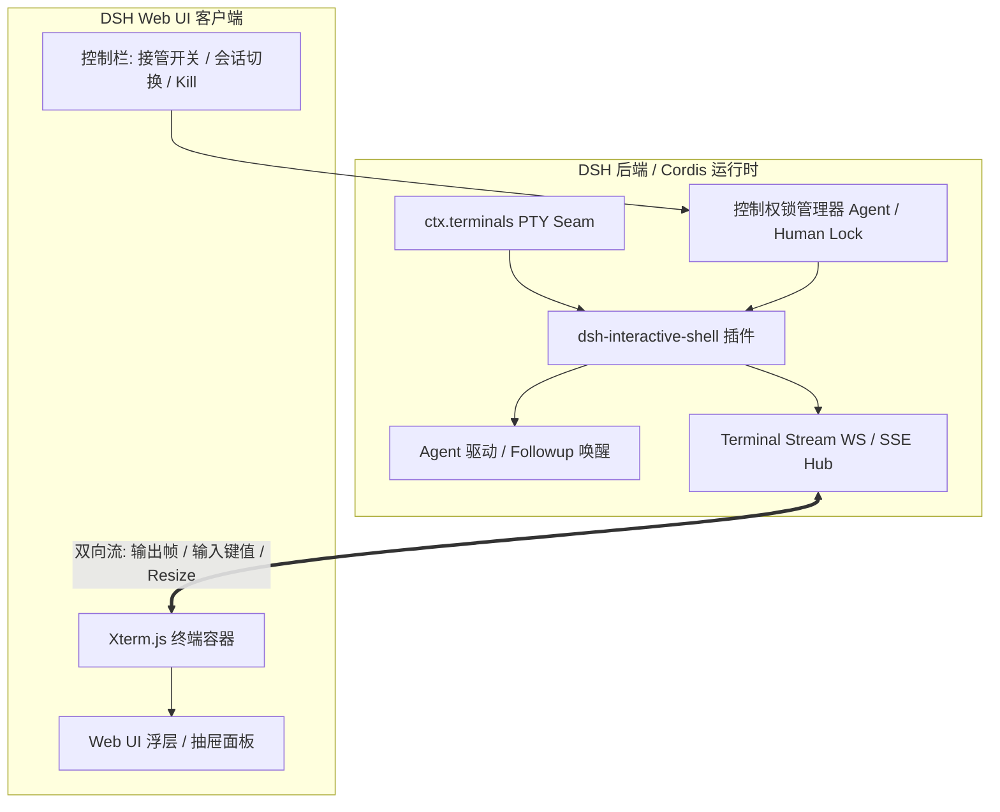
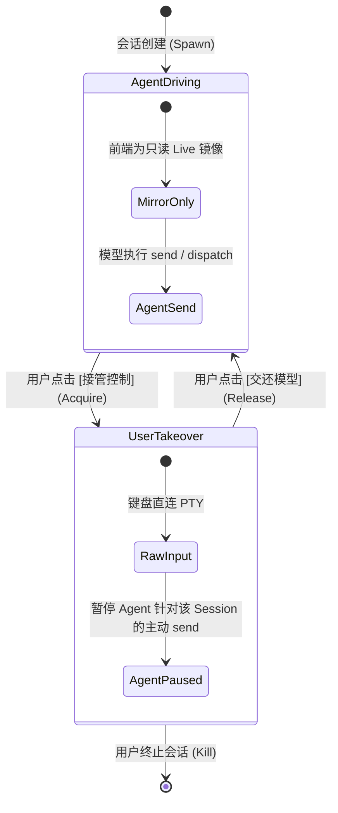

# 里程碑 M4：Web UI 实时监控与用户接管面板规划方案

- **项目**：`dsh-interactive-shell`
- **目标**：为 DeepSeek Harness (DSH) 提供面向 Web 界面侧的 **实时终端流式投影（Live Terminal Stream）** 与 **无缝人机接管（Human-in-the-Loop Takeover）** 能力。
- **状态**：规划设计中

---

## 1. 背景与核心价值

当前 `dsh-interactive-shell` 已完成基于 `@deepseek-ai/dsh-terminal` PTY 管道的后端产品层能力（Dispatch 派发、Monitor 监控触发、Agent 主动唤醒）。然而纯 LLM 文本交互存在如下天然痛点：

1. **黑盒长任务缺乏直观体感**：Agent 跑 `npm run dev` 或 `cargo build` 时，用户只能看对话流中的截断文本，无法直观感受完整 ANSI 渲染、光标进度条或实时滚动。
2. **偶发交互阻塞（如 Sudo 密码、Git 冲突）**：当 CLI 遇到需要人工确认的未知提示时，Agent 容易陷入死锁或盲目尝试；此时**用户直接在 Web 端敲两下键盘解决并交还**是最优雅的解决方案。
3. **Token 开销隔离**：高频流式输出留在前端渲染，仅在发生关键事件时抽取有界摘要给模型，彻底解耦视觉呈现与推理成本。

---

## 2. 总体架构与数据流



---

## 3. 核心机制设计

### 3.1 终端流式通信协议（Terminal Streaming Protocol）
通过 WebSocket 或 Cordis HTTP Stream 服务暴露轻量流式管道：

* **下行数据帧（Server → Client）**：
  * `term:init`：会话初始状态（`sessionId`、`command`、`mode`、`motd`、`cols`、`rows`）。
  * `term:output`：实时 stdout/stderr 二进制或 UTF-8 数据包（带 ANSI escape codes）。
  * `term:event`：生命周期事件（`monitor-triggered`、`dispatch-completed`、`exited`）。
  * `term:lock`：当前控制权状态变迁（`agent_driving` | `user_takeover`）。
* **上行控制帧（Client → Server）**：
  * `term:input`：用户在接管状态下的原始击键输入（Raw bytes / ANSI sequences）。
  * `term:resize`：前端视口尺寸变更（`cols`, `rows`），同步更新 PTY 窗口大小。
  * `term:takeover`：请求获取 / 释放控制权（`action: 'acquire' | 'release'`）。

---

### 3.2 独占控制权与人机协同模型（Takeover & Handover Model）

为防止 Agent 工具调用与用户手工输入产生交错乱序（Race Condition），引入两段式状态锁：



1. **用户接管时（User Takeover）**：
   * 锁定该会话的写入通道，若此时 Agent 发起 `send` 动作，返回 `{ error: 'SESSION_USER_LOCKED', message: 'User is currently interacting with this terminal' }` 或进入等待队列。
2. **用户交还时（Handover back to Agent）**：
   * 释放输入锁，捕获用户操作期间的最终状态与输出尾部。
   * 自动生成上下文注入通知并唤醒 Agent：
     ```text
     [user_takeover] User took over session pty-1, completed manual interactions, and returned control.
     Current viewport tail:
     ...
     ```

---

### 3.3 前端 UI 组件层设计（Web Component & UX）

1. **终端渲染引擎**：
   * 基于 `@xterm/xterm` + `@xterm/addon-fit` + `@xterm/addon-webgl`。
   * 支持全套 ANSI 颜色高亮、光标控制、Vim / Nano / Htop 等复杂 TUI 布局渲染。
2. **面板交互布局**：
   * **Sidecar 抽屉形态**：位于聊天窗口右侧或底部折叠栏，不遮挡主对话流。
   * **多会话 Tab 栏**：顶部显示当前活跃会话（如 `[1] npm test (dispatch)`、`[2] tail app.log (monitor)`），带动态状态红绿指示点。
   * **状态与快捷工具栏**：
     * 模式徽章：`DISPATCH` / `MONITOR` / `INTERACTIVE`。
     * 快捷按钮：`[ 🖐️ 接管控制 / 🔄 交还 ]`、`[ ⏹️ Terminate (Kill) ]`、`[ 📋 复制全部输出 ]`。
     * 触发器可视化：展示当前挂载的正则规则（`Regex: /ERROR/`）或监视文件（`Watch: app.log`）。

---

## 4. 实施阶段拆解（Milestone Steps）

| 阶段 | 任务目标 | 核心产出 | 预计依赖 |
|---|---|---|---|
| **Phase 1: 流式适配层** | 在插件中增加 WebSocket/SSE 广播管道，桥接 PTY stdout/stdin | `src/stream.ts`、Stream RPC 协议定义 | `@deepseek-ai/cordis` |
| **Phase 2: Xterm 基础组件** | 构建只读 Web 终端组件，实现会话实时输出投影（Live Mirror） | `@deepseek-ai/ui-interactive-shell` 或 Web SDK 视图组件 | `xterm`, `@xterm/addon-fit` |
| **Phase 3: 双向接管与锁机制** | 实现用户输入直通、Resize 同步、控制权锁、交还唤醒上下文生成 | 控制权状态机、`term:takeover` 协议实现 | PTY `write` seam |
| **Phase 4: 多会话面板与 UX 整合** | 完成 Tab 切换栏、Sidecar 抽屉、状态指示器及主题自适应 | 完整的 Web 扩展包及 DSH 布局注册 | DSH Web 宿主扩展点 |
| **Phase 5: 端到端联调与压测** | 包含高吞吐流渲染测试、人机交接时序用例、断线重连测试 | 自动化测试、E2E 验收用例 | Playwright / Vitest |

---

## 5. 预期成果与验收标准

1. **实时性**：终端输出端到端渲染延迟 `< 50ms`，大文本吞吐时不卡死浏览器 UI。
2. **正确性**：Vim、Top、Htop、Python REPL 在接管状态下键盘事件 100% 映射无错乱。
3. **人机闭环**：用户接管后退出 Vim 并点击交还，Agent 能立即收到带最新 Viewport 的通知并继续推进主任务。
